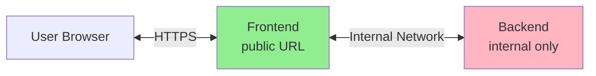

# Reflex Railway Deployment

Generic deployment template for Reflex applications on Railway using Docker.

## Overview

This directory contains reusable deployment scripts and Dockerfiles for deploying any Reflex application to Railway. All app-specific configuration is passed via arguments or environment variables - **no hardcoded values**.

**Security Feature**: The backend service is NOT publicly exposed. Frontend communicates with backend via Railway's internal network.

## Files

| File | Description |
|------|-------------|
| `deploy_all.sh` | Main deployment script (no hardcoded values) |
| `Dockerfile.backend` | Backend service Dockerfile |
| `Dockerfile.frontend` | Frontend service Dockerfile |

## Quick Start

```bash
# Deploy using the generic script
./reflex-railway-deploy/deploy_all.sh \
    -p YOUR_PROJECT \
    -e YOUR_ENVIRONMENT \
    -b YOUR_BACKEND_SERVICE \
    -n YOUR_FRONTEND_SERVICE \
    --skip-db \
    -y
```

## Usage

```
Usage: deploy_all.sh [OPTIONS]

Required Options:
  -p, --project PROJECT       Railway project name
  -e, --environment ENV       Railway environment (e.g., test, production)
  -b, --backend SERVICE       Backend service name
  -n, --frontend SERVICE      Frontend service name

Optional Options:
  -d, --deploy-dir DIR        Deploy directory with Dockerfiles (default: reflex-railway-deploy)
  -t, --team TEAM             Railway team (for team projects)
      --skip-db               Skip PostgreSQL service setup (for demo mode)
  -y, --yes                   Auto mode (skip confirmation pauses)
  -h, --help                  Show this help message
```

## URL Configuration (Security Best Practice)

### Architecture



### Environment Variables Per Service

The deploy script automatically sets these variables:

**Backend Service (NOT publicly exposed):**
| Variable | Value | Description |
|----------|-------|-------------|
| `REFLEX_API_URL` | *(not set)* | Defaults to `http://localhost:8000` |
| `REFLEX_DEPLOY_URL` | *(not set)* | Defaults to `http://localhost:8000` |
| `CORS_ALLOWED_ORIGINS` | `https://<frontend>-<env>.up.railway.app` | Frontend URL for CORS |

**Frontend Service (publicly accessible):**
| Variable | Value | Description |
|----------|-------|-------------|
| `REFLEX_API_URL` | `http://<backend>.railway.internal:8000` | Internal backend URL |
| `REFLEX_DEPLOY_URL` | `https://<frontend>-<env>.up.railway.app` | Frontend's public URL |

### Railway Internal Networking

Railway provides internal DNS for service-to-service communication:
```
http://<service-name>.railway.internal:<port>
```

Benefits:
- **Security**: Backend is not exposed to the public internet
- **Performance**: Lower latency within Railway's network
- **Cost**: No egress charges for internal traffic

## Environment Files

The script loads environment files from the `envs/` directory:
```
envs/
├── .env.base      # Shared config (app name, theme, etc.)
├── .env.prod      # Production settings (loaded for Railway)
└── .env.secrets   # API keys (gitignored)
```

### App-Specific Variables

Set `APP_ENV_VARS` to a comma-separated list of variable names to sync:

```bash
export APP_ENV_VARS="APP_NAME,CLINIC_NAME,THEME_COLOR"
```

## Creating an App-Specific Wrapper

Create an app-specific script in your project's `scripts/` directory:

```bash
#!/bin/bash
# scripts/deploy_myapp.sh
set -e

RAILWAY_PROJECT="my-project"
RAILWAY_ENVIRONMENT="${1:-test}"
BACKEND_SERVICE="myapp-backend"
FRONTEND_SERVICE="myapp"

export APP_ENV_VARS="APP_NAME,SECRET_KEY"

./reflex-railway-deploy/deploy_all.sh \
    -p "$RAILWAY_PROJECT" \
    -e "$RAILWAY_ENVIRONMENT" \
    -b "$BACKEND_SERVICE" \
    -n "$FRONTEND_SERVICE" \
    --skip-db \
    -y
```

Then deploy with:
```bash
./scripts/deploy_myapp.sh              # Deploy to test
./scripts/deploy_myapp.sh production   # Deploy to production
```

## Dockerfiles

### Backend Dockerfile

Runs `reflex run --env prod --backend-only` on port 8000.

Includes:
- Python 3.11
- Build essentials (gcc, g++)
- PostgreSQL client libraries
- unzip, curl (for Reflex/bun)
- uv package manager

### Frontend Dockerfile

Runs `reflex run --env prod --frontend-only` on port 3000.

Same dependencies as backend.

## Prerequisites

1. **Railway CLI**: Install with `npm i -g @railway/cli`
2. **Railway Login**: Run `railway login`
3. **jq**: Required for JSON parsing (`apt install jq` or `brew install jq`)

## Troubleshooting

### Service Creation Fails
- Ensure you're logged into Railway: `railway whoami`
- Check project exists: `railway list`

### WebSocket Connection Fails
- Ensure frontend's `REFLEX_API_URL` points to internal backend URL
- Check backend is running: `railway logs --service <backend-name>`
- Verify internal DNS: `http://<backend>.railway.internal:8000`

### Build Fails
- Check Dockerfile has all required system dependencies
- Ensure `pyproject.toml` and `uv.lock` exist in project root
- Check Railway logs: `railway logs --service <service-name>`

## Additional Resources

- [Railway Documentation](https://docs.railway.app/)
- [Railway Private Networking](https://docs.railway.app/reference/private-networking)
- [Reflex Documentation](https://reflex.dev/docs/)
